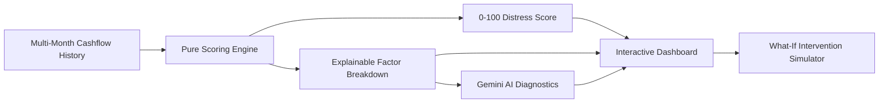

# SentinelFin — Financial Distress Early-Warning System

> **Hackathon Event:** Innovation Unbound — CodeChef VIT Chennai Chapter  
> **Problem Statement:** *Preventing Financial Distress Before It Becomes a Crisis*

---

## 📌 Problem Statement

**Preventing Financial Distress Before It Becomes a Crisis**

Most people do not realize their financial health is deteriorating until they are already struggling with missed loan EMIs, compounding credit-card interest, lifestyle inflation, or an exhausted emergency fund. 

Traditional credit bureaus (like CIBIL, Experian, or FICO) are **lagging indicators** — they only record distress *after* a borrower misses a payment or enters default. By the time a traditional score drops, the borrower is already trapped in high-interest debt cycles.

---

## 💡 The Approach: Trend & Velocity vs. Static Snapshots

**SentinelFin** is a proactive financial intelligence dashboard that identifies early signals of financial distress **3 to 6 months before default occurs**.

Instead of judging a single point in time, SentinelFin evaluates **multi-month velocity and behavioral shifts**:



### 1. Pure & Explainable Scoring Formula (No Black Box)
The scoring engine evaluates 5 weighted components totaling 100%:
- **Expense-to-Income Velocity (25%)**: Detects when living expenses outpace income growth over multiple months.
- **Fixed Debt Service Burden (25%)**: Tracks mandatory debt obligations (EMIs + card bills) as a percentage of income.
- **Credit Card Minimum-Due Trap (25%)**: Flags the #1 leading indicator of financial distress — transitioning from paying full balances to revolving minimum dues at 40%+ APR.
- **Emergency Savings Buffer (15%)**: Measures liquid reserves in months of runway and penalizes rapid cash depletion.
- **Discretionary Spending Creep (10%)**: Identifies unmonitored lifestyle inflation consuming free cashflow.

### 2. Four Synthetic Archetypes (Realistic Demo Scenarios)
1. **Stable Saver**: Steady income, consistent 25%+ savings rate, zero revolving debt, 6+ month emergency cushion (*Score: ~15-20, Low Risk*).
2. **Slow Decliner (*The Pitch Showcase*)**: Income is flat, discretionary spend creeps up, card bills shift to minimum-due payments, and savings drain over 6 months. **The distress score surges from 22 to 78 long before any EMI is missed.**
3. **Already in Distress**: Mandatory debt commitments exceed earnings, savings are negative, and interest compounds (*Score: 85+, Critical*).
4. **Recovering Resilient**: Demonstrates positive momentum as discretionary cuts and disciplined debt paydowns rebuild savings and reduce risk from 82 down to 38.

### 3. AI Diagnostics Layer (Gemini API + Offline Fallback)
Synthesizes plain-language financial health diagnoses and 2-3 concrete, prioritized action steps (e.g. specific rupee amounts to trim, consolidation plans, buffer targets). Fully supported by an offline analytical fallback engine if no API key is present.

### 4. Interactive "What-If" Resilience Simulator
Empowers users to model interventions in real time (e.g. *"What if I cut dining spend by 20% and pay 100% of my card bill?"*) and witness their projected risk score drop immediately.

---

## 🛠️ Tech Stack

- **Framework**: [Next.js 15](https://nextjs.org/) (App Router, React 19, Strict Mode)
- **Language**: TypeScript
- **Styling**: Tailwind CSS + Custom Dark Theme Glassmorphism
- **Data Visualizations**: [Recharts](https://recharts.org/) (Multi-mode Area & Composed Charts)
- **Icons**: Lucide React
- **AI / LLM Layer**: Google Gemini API (`@google/generative-ai` / REST) & OpenRouter API support with resilient deterministic fallback
- **Data Persistence**: Static JSON synthetic dataset (Zero PII, fully offline-capable)

---

## 🚀 Getting Started

Follow these steps to run the project locally on your machine:

### 1. Prerequisites
- **Node.js** (v18.17.0 or higher recommended, tested on v20+)
- **npm** (v9+) or **pnpm** / **yarn**

### 2. Clone the Repository
```bash
git clone https://github.com/eka1357/VHac.git
cd VHac
```

### 3. Install Dependencies
```bash
npm install
```

### 4. Environment Variables (Optional)
Create a `.env.local` file in the root directory if you wish to use live LLM insights (otherwise, the app uses its built-in rule diagnostics fallback seamlessly):

```env
# Optional: Google Gemini API Key
GEMINI_API_KEY=your_gemini_api_key_here

# Or OpenRouter API Key
OPEN_ROUTER_API_KEY=your_openrouter_api_key_here
```

### 5. Generate / Verify Synthetic Data (Optional)
The static dataset is already pre-built in `data/personas.json`. You can re-generate it anytime by running:
```bash
npm run generate:data
```

### 6. Run Scoring Engine Unit Tests
```bash
npm test
```
*Runs the 6 unit tests verifying low risk, early-warning triggers, explainable factor ranking, and deterministic behavior.*

### 7. Start the Development Server
```bash
npm run dev
```

Open [http://localhost:3000](http://localhost:3000) in your browser to explore the dashboard!

---

## 📂 Project Structure

```
VHac/
├── app/
│   ├── api/
│   │   └── insights/route.ts       # Gemini AI & fallback insights endpoint
│   ├── globals.css                 # Dark theme design system & glassmorphism
│   ├── layout.tsx                  # Root layout & SEO metadata
│   └── page.tsx                    # Main dashboard container & state orchestration
├── components/
│   ├── Header.tsx                  # Persona switcher & title header
│   ├── MetricCard.tsx              # Cashflow, income, debt, and runway cards
│   ├── RiskGauge.tsx               # Radial distress index meter & early-warning banner
│   ├── TrendChart.tsx              # Recharts 6-month trajectory graphs
│   ├── ContributingFactors.tsx     # Ranked explainable risk attribution list
│   ├── AiInsightsPanel.tsx         # AI summary and prioritized action recommendations
│   └── WhatIfSimulator.tsx         # Real-time interactive intervention sliders
├── data/
│   └── personas.json               # Pre-baked static 6-month snapshots for 4 personas
├── lib/
│   ├── scoring.ts                  # Pure, deterministic, unit-tested risk formula
│   └── types.ts                    # Strict TypeScript interfaces & schemas
├── scripts/
│   └── generate_dataset.mjs        # Synthetic data generator script
└── tests/
    └── scoring.test.mjs            # Unit test suite for scoring engine
```

---

## 🏆 Key Submission Checklist (Definition of Done)

- [x] Loads straight to dashboard with instant persona switcher (no auth needed).
- [x] Shows current Risk Score (0-100) + 6-month trend line.
- [x] Displays top contributing factors with transparent weights and plain-language labels.
- [x] Displays concrete, personalized next-step recommendations.
- [x] The **Slow Decliner** persona visibly demonstrates early warning (+56 pt rise before any missed EMI).
- [x] Interactive "What-If" simulation to show corrective resilience.
- [x] Runs with `npm run dev` from a clean clone.

---

## 📄 License
MIT License. Built for the Innovation Unbound Hackathon 2026.
